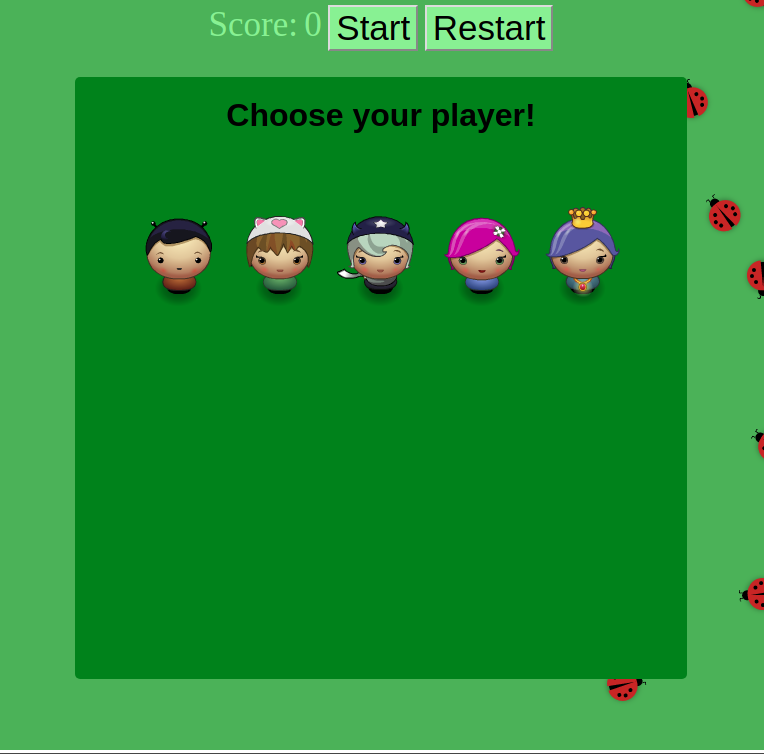
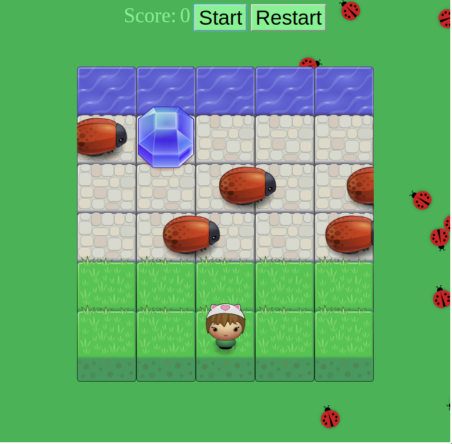

Arcade Game

. In this game, you have a player and enemies(bugs). 

. First you have to choose which player you want to play.

. Second to start the game you have to press the button Start.

. Then, to move the player use keys Arrow up, left,right,down.

. To win the game you have to not collide with the bugs and you have to reach the water , besides that , you can also collect one gem to have  10 point more. 

. You can play the game as long as you like and if you want to restart the score just click on the restart button.

>>>>>>> 99306fbccf64c3d66cc2a20e6ef470c4c53874e6
